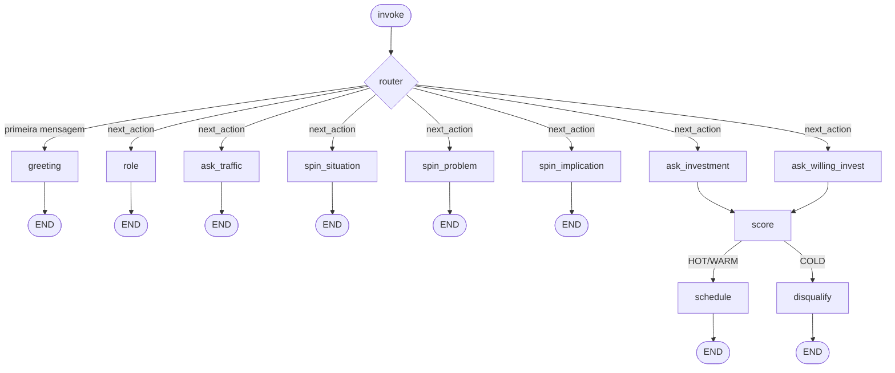

# sdr-agent-langgraph

> Agent SDR de qualificação B2B implementado em **LangGraph** — portado a partir de um workflow de produção em n8n, sanitizado pra uso público como referência de arquitetura.

[](https://opensource.org/licenses/MIT)
[](https://www.python.org/downloads/)
[](https://langchain-ai.github.io/langgraph/)

## O que é

Um agent de qualificação SDR (Sales Development Representative) que recebe mensagens de leads e decide em tempo real se vale agendar reunião ou descartar — baseado em:

- **SPIN simplificado** (Situação, Problema, Implicação)
- **Filtro de orçamento** (piso configurável, default R$1500/mês)
- **Score + label** (HOT / WARM / COLD)

Saída final: lead qualificado vai pro CRM com label, score e contexto. Lead desqualificado é encerrado com simpatia.

## Por que LangGraph e não LangChain

LangChain encadeia chamadas linearmente (A → B → C). LangGraph modela como **grafo de estados** — permite loops, branching condicional, persistência de state e human-in-the-loop. Pra agent conversacional multi-turno com regras de negócio (como qualificação SDR), grafo é o paradigma certo. Chain quebra na primeira ramificação.

## Arquitetura



Cada **invoke do grafo = um turno de conversa**. O `next_action` no state guia qual node executa no próximo turno. Conversa multi-turno é construída externamente pelo CLI ou webhook.

## Stack

| Camada | Tech |
|---|---|
| Orquestração | LangGraph 0.2+ |
| LLM | Anthropic Claude (mock incluído pra testes) |
| Mensageria | Adapter pattern (Mock + Evolution API skeleton) |
| CRM | Adapter pattern (Mock + Monday/HubSpot skeleton) |
| Calendar | Adapter pattern (Mock + Google Calendar skeleton) |
| Testing | pytest |
| Lint | ruff |

## Estrutura

```
src/sdr_agent_langgraph/
├── state.py            # AgentState (TypedDict) — memória compartilhada
├── graph.py            # build_graph() — monta o StateGraph
├── nodes/              # cada node = 1 função (state) -> dict updates
│   ├── greeting.py
│   ├── role.py
│   ├── spin.py         # 3 nodes: situation, problem, implication
│   ├── investment.py   # 3 nodes: ask_traffic, ask_investment, ask_willing_invest
│   ├── score.py        # regra canônica de qualificação
│   ├── schedule.py     # HOT/WARM
│   └── disqualify.py   # COLD
├── edges/routing.py    # função de roteamento condicional
├── adapters/           # interfaces pra LLM, messaging, CRM, calendar
│   ├── llm.py          # Mock + Anthropic
│   ├── messaging.py    # Mock + Evolution
│   ├── crm.py          # Mock + skeleton
│   └── calendar.py     # Mock + skeleton
├── prompts/system.py   # personas e prompts genéricos
└── cli.py              # sessão interativa no terminal
```

## Regra de qualificação (canônica)

| Investimento mensal | Score | Label | Ação |
|---|---|---|---|
| ≥ R$3.000 | +30 | **HOT** | agenda reunião direta |
| R$1.500 – R$2.999 | +20 | **WARM** | agenda reunião |
| Só indicação + disposto a investir ≥ R$1.500 | +15 | **WARM** | agenda (ângulo educacional) |
| R$1 – R$1.499 (já investe) | -30 | **COLD** | descarta (`budget_below_minimum`) |
| Só indicação + não disposto | 0 | **COLD** | descarta (`budget_not_available`) |

Thresholds configuráveis via env vars `MIN_INVESTMENT` e `HOT_THRESHOLD`.

## Rodar localmente

```bash
git clone https://github.com/valterjuniorsilv/sdr-agent-langgraph
cd sdr-agent-langgraph

python3 -m venv .venv
source .venv/bin/activate
pip install -e ".[dev]"

# Rodar testes (todos mockados, sem API key)
pytest -v

# Rodar CLI interativo (precisa ANTHROPIC_API_KEY pro modo real, mas funciona standalone com mock)
iris
```

## Comparação com a versão original em n8n

Esse agent foi originalmente um workflow visual no n8n (~50 nodes, integração com Evolution API + Redis + Monday CRM). Reescrito em LangGraph pra demonstrar:

| Aspecto | n8n (original) | LangGraph (este repo) |
|---|---|---|
| Edição | Visual no browser | Código Python |
| Tipagem | Sem tipos (JSON) | TypedDict + pydantic |
| Testes automatizados | Difícil (workflow live) | pytest nativo |
| Loops complexos | Possível mas verboso | Idiomático |
| Audit trail | Logs do n8n | LangSmith opcional |
| Deploy | Hetzner self-host | Docker + qualquer runtime Python |
| Quem edita | Qualquer pessoa (GUI) | Apenas devs |

**Quando preferir n8n:** integrações múltiplas óbvias, equipe não-dev edita, prototipagem rápida.
**Quando preferir LangGraph:** controle de state, loops/branching complexo, observabilidade enterprise, latência baixa, agent stateful.

## Adapters: estendendo pra produção

Cada integração externa tem uma interface `Protocol` + 1 implementação `Mock` (usada nos testes) + esqueleto pra implementação real:

```python
from sdr_agent_langgraph.adapters import EvolutionMessaging, MockMessaging

# Em testes:
messaging = MockMessaging()

# Em produção:
messaging = EvolutionMessaging(
    base_url="https://your-evolution.com",
    api_key=os.environ["EVOLUTION_API_KEY"],
    instance="your-instance",
)
```

## Roadmap

- [x] Estado tipado + grafo core
- [x] Nodes: greeting, role, SPIN, investment, score, schedule, disqualify
- [x] Adapters mockados + Anthropic real
- [x] Suite de testes
- [x] CLI standalone
- [ ] Webhook FastAPI pra integração WhatsApp
- [ ] Persistência de state em Postgres (LangGraph checkpoint)
- [ ] Adapter Monday CRM real
- [ ] Adapter Google Calendar real
- [ ] Dockerfile + deploy guide
- [ ] LLM-powered classification dos campos SPIN (extrair structured data)

## License

MIT — ver [LICENSE](./LICENSE).

## Author

**Valter Silva** · [github.com/valterjuniorsilv](https://github.com/valterjuniorsilv)
